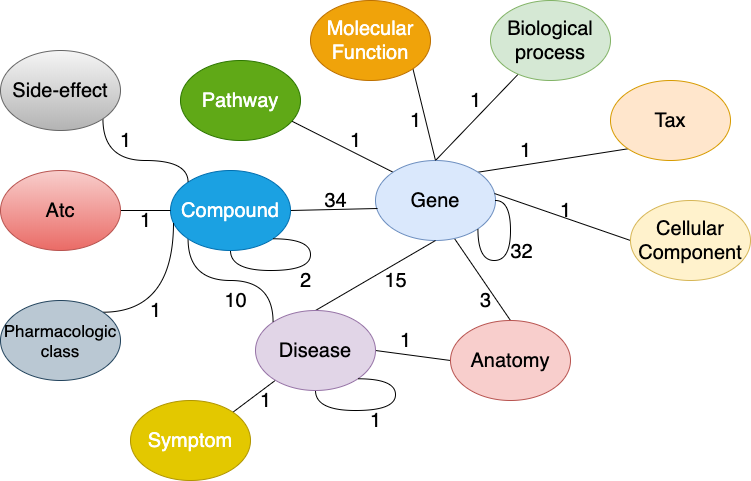
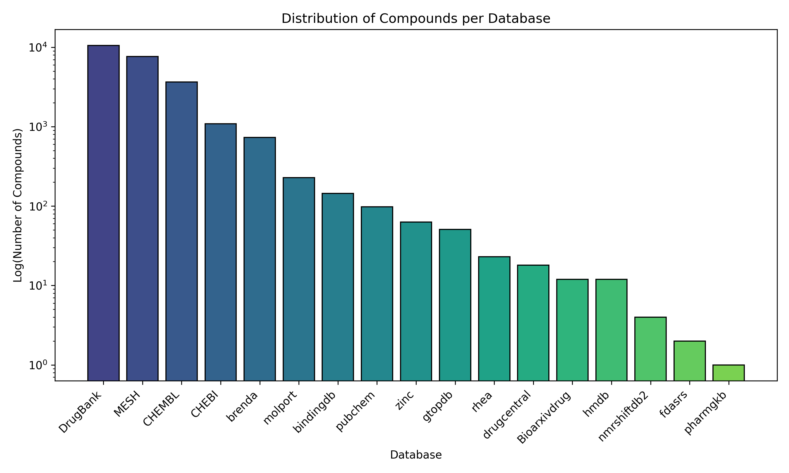
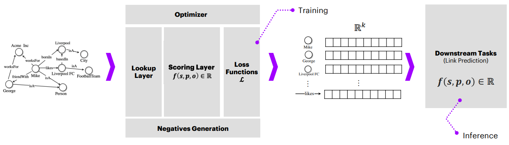

<h1 align="center">
    DengueDrugRep
</h1>

<p align="center">
    <a href="https://github.com/sayalaruano/DengueDrugRep/blob/main/LICENSE.md">
        
    </a>
        <a href="https://zenodo.org/doi/10.5281/zenodo.10010151">
        
    </a>
    <a href="https://colab.research.google.com/github/sayalaruano/DengueDrugRep/blob/main/Training_KGNN_models_Pykeen.ipynb">
        
    </a>
</p>

<p align="center">
   Drug repurposing for dengue using a biomedicine knowledge graph and graph neural networks
</p>

## **Table of contents:**
- [About the project](#about-the-project)
- [Dataset](#dataset)
- [Exploratory data analysis](#exploratory-data-analysis)
- [Graph neural network models](#graph-neural-network-models)
- [Evaluation](#evaluation)
- [How to set up the environment to run the code?](#how-to-set-up-the-environmen-to-run-the-code)
- [Structure of the repository](#structure-of-the-repository)
- [Credits](#credits)
- [Further details](#details)
- [Contact](#contact)

## **About the project**

[Dengue][dengue] is a viral infection transmitted to humans through the bite of Aedes mosquitoes. This disease is a  neglected tropical disease that mainly affects poor populations with no access to safe water, sanitation, and high-quality healthcare. Currently, there is no specific treatment for dengue and the focus is on treating pain symptoms. Therefore, there is an urgent need to find new drugs to treat this disease.

The goal of this project is to predict new repurposed drugs for dengue using a biomedical knowledge graph and graph neural networks. A knowledge graph (KG) is a heterogeneous network with different types of nodes and edges that incorporate semmantic information. A KG is composed of a set of triplets (subject, predicate, object) that represent relationships between entities. For example, a drug-disease triplet represents the relationship between a drug (subject) and a disease (object) through a predicate (e.g., treats, causes, etc.). The advantage of using a KG is that it allows the integration of different types of data from different sources.

Graph neural networks (GNNs) are a class of neural networks that can learn from graph data. GNNs have been used to solve different tasks in KGs, such as node classification, link prediction, and entity alignment. The drug repurposing problem can be formulated as a link prediction task in a KG. The goal is to predict new drug-disease associations for Dengue. 

The following figure shows the general workflow of this project:
<p align="center">
<figure>
  
  <figcaption><strong>Figure 1.</strong> DengueDrugRep workflow </a>. </figcaption>
</figure>
</p>


## **Dataset**

The [DRKG][drkg] is a large-scale biomedical KG that integrates information from six existing databases: [DrugBank][drugbank], [Hetionet][hetionet], Global network of biomedical relationships ([GNBR][gnbr]), [String][string], [IntAct][intact], and [DGIdb][dgidb]. This KG contains 97.238 nodes belonging to 13 entity-types (e.g., drugs, diseases, genes, etc.) and 5.874.257 triplets belonging to 107 edge-types. Also, the DRKG contains 24.313 compounds from 17 different databases (the list of databases' names is available in the [Names_datasources_compounds_DRKG.csv][names_db_compounds] file). 

The following figure shows a schematic representation of the DRKG:

<p align="center">
<figure>
  
  <figcaption><strong>Figure 2.</strong> Interactions in the DRKG. The number next to an edge indicates the number of relation-types for that entity-pair in the KG. Obtained from <a href="https://github.com/gnn4dr/DRKG">[2]</a>. </figcaption>
</figure>
</p>

The [PyKEEN][pykeen] library implements the DRKG as part of its datasets, so it is possible to load the DRKG directly from the library. 

The DRKG was split into training, validation, and test sets. The training set contains 4.699.405 triplets, the validation set contains 587.426 triplets, and the test set contains 587.426 triplets. The training partition was used to train the models, and the validation partition was used to evaluate the models. The test dataset was used to make predictions on unseen data.

## **Exploratory data analysis**
In this project, I focused on the drug-disease relationships in the DRKG. So, the first step was to explore what are the predicates that represent these relationships, obtaining the following list:

| Drug-Disease predicate |
| ---------------------- |
| DRUGBANK:: treats::Compound:Disease |
| GNBR:: C::Compound:Disease |
| GNBR:: J::Compound:Disease |
| GNBR:: Mp::Compound:Disease |
| GNBR:: Pa::Compound:Disease |
| GNBR:: Pr::Compound:Disease |
| GNBR:: Sa::Compound:Disease |
| GNBR:: T::Compound:Disease |
| Hetionet:: CpD::Compound:Disease |
| Hetionet:: CtD::Compound:Disease |

More details about the predicates, their provenance and meaning are available in the [relation_glossary.tsv][drkg_schema] file and the DRKG [GitHub repository][drkg].

Next, I explored the number of compounds per database in the DRKG. The following figure shows the results:
<p align="center">
<figure>
  
  <figcaption><strong>Figure 3.</strong> Distribution of compounds per database in DRKG</a>. </figcaption>
</figure>
</p>

The code for this part is available in the Python script [DRKG_compounds_names_preprocessing.py][compounds_names_script].

## **Graph neural network models**

In general, GNNs represent entities and relationships in a KG as vectors in a low-dimensional space (embeddings). Then, these vectors are scored to predict new triplets. The scoring function can be based on distance or similarity measures, depending on the type of GNN. During the training process, there is a loss function that measures the difference between the predicted and the true triplets. The goal is to minimize this loss function. Also, there is a negative generator that creates false triplets to train the model. The negative generator creates triplets by replacing the subject, predicate, or object of a true triplet with a random entity of the same type.

The following figure illustrates the general structure of a knowledge graph neural network (KGNN): 

<p align="center">
<figure>
  
  <figcaption><strong>Figure 4.</strong> Anatomy of a Knowledge Graph Neural Network. Obtained from <a href="https://kge-tutorial-ecai2020.github.io/">[1]</a>. </figcaption>
</figure>
</p>

For this project, four GNN algorithms, namely [PairRE][pairRE], [DistMult][distmult], [ERMLP][ermlp], and [TransR][transr], were trained to predict new drug-disease associations using the Drug Repurposing Knowledge Graph ([DRKG][drkg]). These algorithms are implemented in the [PyKEEN][pykeen] library. The models were trained using the Marging Ranking Loss function and a random seed of 1235. The rest of the hyperparameters were the default values of the library. 

First, the models were trained for 50 epochs with a general evaluation procedure using all the triplets in the DRKG. In this way, the evaluation results reflected the link prediction performance for all the entity pairs in the KG. Next, new models were trained for 10 epochs with a drug repurposing evaluation procedure using only the triplets that involve drugs and diseases. Here, it was shown the link prediction performance for the task of predicting new drug-disease associations.

You can find the code for this part on the Jupyter Notebook [Training_KGNN_models_Pykeen.ipynb][training_script].

The trained models are available through Zenodo with the following DOI: [10.5281/zenodo.10010151][models_doi].

## **Evaluation**

The KGNN models were evaluated: **a)** intrinsically, within the scope of the knowledge graph and its defined triples, and **b)** externally, against a ground truth (drugs on clinical trials to treat dengue) to understand their predictive power over real-world information.

Before running the evaluation scripts, you should download the trained models from [Zenodo][models_doi] and save them in a folder called `Models/`.

### **Internal evaluation**

Two standard rank-based metrics were used to measure each KGNN model’s intrinsic performance on link prediction:

- **Adjusted Mean Rank(AMR):** the ratio of the Mean Rank to the Expected Mean Rank, assessing a model’s performance independently of the underlying set size. It lies on the open interval (0,2), where lower is better.
- **Hits@k:** the fraction of times when the correct or “true” entity appears under the top-k entities in the ranked list. The value of hits@k is between 0 and 1. The larger the value, the better the model works. For this project, I estimated hits@1, hits@3, hits@5, and hits@10 metrics

All the internal evaluation metrics were calculated using the [PyKEEN][pykeen] library. I reported the optimistic rank values for both the tail and head entities, which assumes that the true choice is on the first position of all those with equal score when there are multiple choices. More details about how the evaluation for KGNN models works in PyKEEN can be found [here][pykeen_evaluation].

Check it out the code for this part of the project in the Python script [Int_performance_evaluation_KGNNs.py][int_eval_script].

The results for this part are available in the [Internal_evaluation](Results/Internal_evaluation) folder.

### **External evaluation**

To validate the KGNN models externally, I analyzed the predicted ranked compound list against the  drugs on clinical trials to treat dengue defined in ground truth using the following metrics: 

- **First hit:** the ranking position at which compounds proposed by a KGNN model match one from the ground truth database.
- **Median hit:** the ranking position at which compounds proposed by a KGNN model match 50% of the compounds from the ground truth database.
- **Last hit:** the ranking position at which compounds proposed by a KGNN model match all the compounds from the ground truth database.

For all these metrics, the smaller the value, the better, meaning that a model with lower “first”, “median”, or “last hit” values compared to another one, matches real-world compounds using fewer predictions.

The ground truth database was obtained from the [ClinicalTrials.gov][clinicaltrials] website. I searched for clinical trials that use drugs to treat dengue. I found 21 clinical trials that use 16 drugs to treat this disease. Also, I look for the IDs of these drugs from the 17 compound databases in the DRKG using the CHEMBL API and manual validation. The list of the drugs in the ground truth database and their IDs in the compound databases of DRKG are available in the [dengue_validated_drugs_clin.csv][clin_trial_drugs].

You can find the code for this part on the Python script [External_performance_evaluation_KGNNs.py][ext_eval_script].

The results for this part are available in the [External_evaluation](Results/External_evaluation) and [CompoundDisease_predictions](Results/CompoundDisease_predictions) folders.

## **How to set up the environment to run the code?**

I used [Pipenv](https://pypi.org/project/pipenv/) to create a Python virtual environment, which allows the management of python libraries and their dependencies. Each Pipenv virtual environment has a `Pipfile` with the names and versions of libraries installed in the virtual environment, and a `Pipfile.lock`, a JSON file that contains versions of libraries and their dependencies.

To create a Python virtual environment with libraries and dependencies required for this project, you should clone this GitHub repository, open a terminal, move to the folder containing this repository, and run the following commands:

```bash
# Install pipenv
$ pip install pipenv

# Create the Python virtual environment 
$ pipenv install

# Activate the Python virtual environment 
$ pipenv shell
```

You can find a detailed guide on how to use pipenv [here](https://realpython.com/pipenv-guide/).

Alternatively, you can create a conda virtual environment with the required libraries using the `requirements.txt` file. To do this, you should clone this GitHub repository, open a terminal, move to the folder containing this repository, and run the following commands:

```bash
# Create the conda virtual environment
$ conda env create --name denguedrugrep --file requirements.txt

# Activate the conda virtual environment
$ conda activate denguedrugrep
```

## **Structure of the repository**
The main files and directories of this repository are:

|File|Description|
|:-:|---|
|[Data/](Data/)|Folder with summary of the entities and relationships in DRKG and a csv file of the drugs in clinical trials to treat dengue|
|[Scripts/](Scripts/)|Folder with the Python scripts to train and evaluate the KGNN models|
|[Results/](Results/)|Folder to save performance metrics and other outputs of the KGNN models|
|[DengueDrugRep.pdf](DengueDrugRep.pdf)|Presentation with detailed explanation of the project|
|[Pipfile](Pipfile)|File with names and versions of packages installed in the virtual environment|
|[requeriments.txt](requeriments.txt)|File with names and versions of packages installed in the virtual environment|
|[Pipfile.lock](Pipfile.lock)|Json file that contains versions of packages, and dependencies required for each package|
|[img/](img/)|images and gifs|

## **Credits**
- Developed by [Sebastián Ayala Ruano](https://sayalaruano.github.io/). I created this repository for my capstone project of the Scientific Programming course from the [MSc in Systems Biology][sysbio] at [Maastricht University][maasuni].

- Part of the code for this project was inspired by the PyKEEN [tutorials][pykeen_tutorials], a [conference paper][confpaper], and this [GitHub repository][githubrepo].

## **Further details**
More details about the biological background of the project, the interpretation of the results, and ideas for further work are available in this [presentation](denguedrugrep_report.pdf).

## **Contact**
[](https://twitter.com/sayalaruano)

If you have comments or suggestions about this project, you can [open an issue](https://github.com/sayalaruano/DengueDrugRep/issues/new) in this repository, or email me at sebasar1245@gamil.com.

[dengue]: https://www.who.int/news-room/fact-sheets/detail/dengue-and-severe-dengue
[confpaper]: https://link.springer.com/chapter/10.1007/978-3-031-40942-4_8
[pykeen_tutorials]: https://github.com/pykeen/pykeen/tree/master/notebooks
[sysbio]: https://www.maastrichtuniversity.nl/education/master/systems-biology
[maasuni]: https://www.maastrichtuniversity.nl/
[myweb]: https://sayalaruano.github.io/
[githubrepo]: https://github.com/sayalaruano/DengueDrugRep
[pairRE]: http://arxiv.org/abs/2011.03798
[distmult]: https://arxiv.org/abs/1412.6575
[transr]: http://www.aaai.org/ocs/index.php/AAAI/AAAI15/paper/download/9571/9523/
[ermlp]: https://storage.googleapis.com/pub-tools-public-publication-data/pdf/45634.pdf
[pykeen]: https://github.com/pykeen/pykeen
[drkg]: https://github.com/gnn4dr/DRKG
[pykeen_evaluation]: https://pykeen.readthedocs.io/en/stable/tutorial/understanding_evaluation.html
[training_script]: ./Scripts/Training_KGNN_models_Pykeen.ipynb
[int_eval_script]: ./Scripts/Internal_performance_evaluation_KGNNs.py
[ext_eval_script]: ./Scripts/External_performance_evaluation_KGNNs.py
[compounds_names_script]: ./Scripts/DRKG_compounds_names_preprocessing.py
[clin_trial_drugs]: ./Data/Clinical_trials/dengue_validated_drugs_clin.csv
[clinicaltrials]: https://clinicaltrials.gov/
[models_doi]: https://zenodo.org/doi/10.5281/zenodo.10010151
[drugbank]: https://go.drugbank.com/
[hetionet]: https://het.io/about/
[gnbr]: https://doi.org/10.1093/bioinformatics/bty114
[string]: https://string-db.org/
[intact]: https://www.ebi.ac.uk/intact/
[dgidb]: https://www.dgidb.org/
[drkg_schema]: ./Data/DRKG/relation_glossary.tsv
[names_db_compounds]: ./Data/DRKG/Names_datasources_compounds_DRKG.csv
